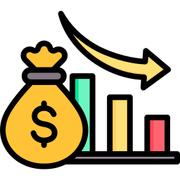

This site covers the documentation of **Consumer Pod**. Please feel free to use the **Search** function.

  <a href="getting-started" class="tile">
    <h3>Getting Started</h3>
    
    
Introduction

  </a>
  <a href="platform" class="tile">
    <h3>Platform</h3>
    
    
Setup features for your application and follow our best practices

  </a>
  <!-- <a href="development-guides" class="tile">
    <h3>Development Guides</h3>
    
    
Guides that will help you create your environment

  </a> -->
  <a href="platform/cost_optimization/" class="tile">
    <h3>Cost Optimization</h3>
    
    
Cost Optimization for general resources

  </a>
  <a href="support" class="tile">
    <h3>DevOps and Support</h3>
    
    
Get support from teams

  </a>
  <a href="security-compliance-topics" class="tile">
    <h3>Security and Compliance</h3>
    
    
Security and compliance related topics

  </a>
  <a href="news-announcements" class="tile">
    <h3>Announcements</h3>
    
    
Get the latest announcements from Hyperion Team

  </a>

